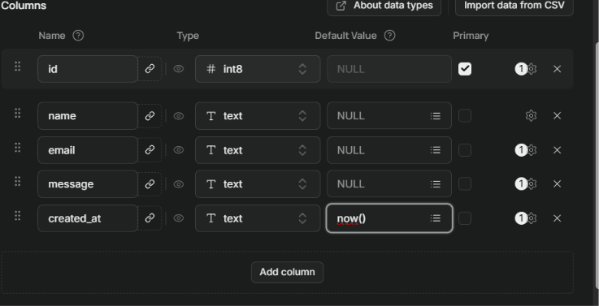
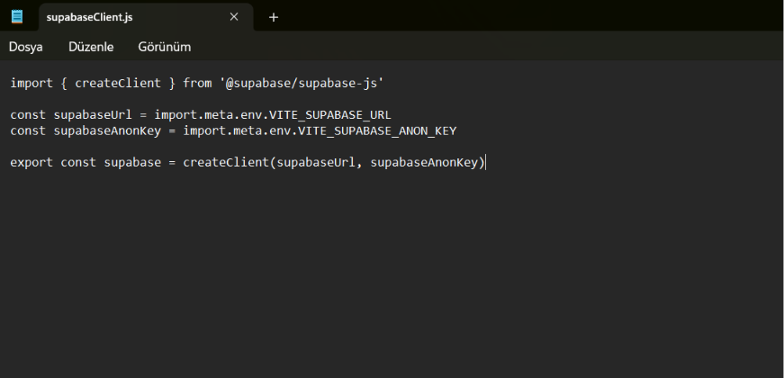
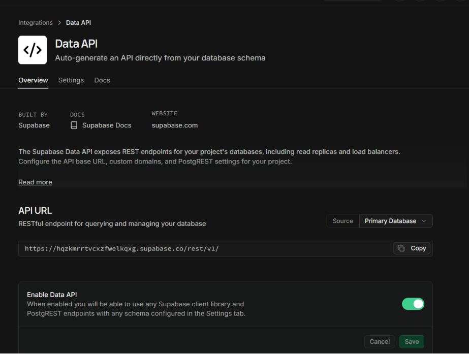
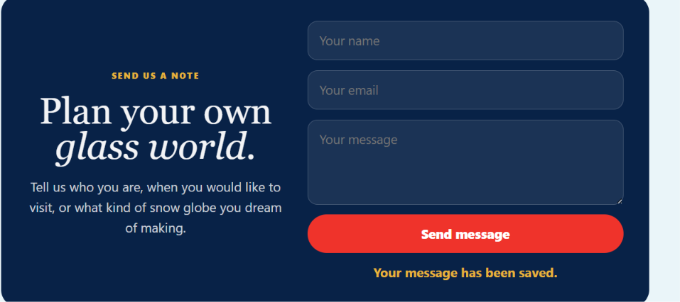
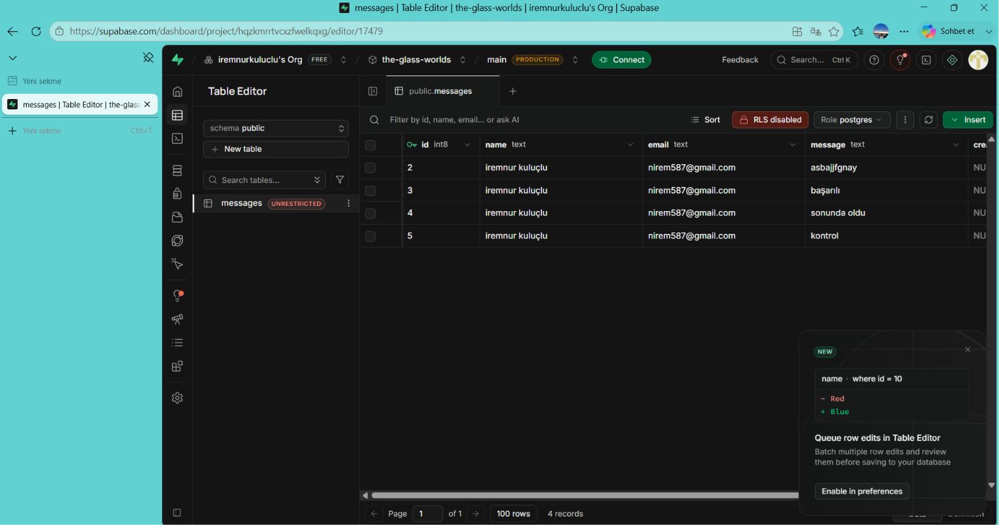

 - The Glass Worlds

The Glass Worlds, özel kar küresi atölyesini tanıtan tek sayfalık bir landing page projesidir. Sayfa; büyük hero alanı, süreç kartları, galeri, atölye detayları, kullanıcı yorumu bölümlerinden oluşur.

- Canlı Site

https://the-glass-worlds.vercel.app

- GitHub Repo

https://github.com/iremnurkuluclu/the-glass-worlds

- Konsept

Bu projede hayali bir kar küresi tasarım atölyesi tasarladım.Kışı ve ormanı çağrıştıran uyumlu renkler kullandım. Kullanıcılar sayfada atölyenin atmosferini, yapım sürecini, dahil olan hizmetleri ve etkinlik tarihlerini görebilir.

- Kullanılan Teknolojiler ve Araçlar

- React
- Vite
- Framer Motion
- CSS
- GitHub
- Vercel
- Cursor
- Codex
- Kling AI 

- Kullandığım Önemli Promptlar

1.Create a modern web Hero section using these exact design specifications:

- Typography & Content: The main title must be exactly: "Welcome to your magical little world that will always stay the same." Use an elegant Serif font for this heading.
- Main Background & Text Card Color: Deep Navy Blue (#09122C)
- CTA Button Color: Crimson/Coral (#E94560)
- Page Framing/Background Color: Slate Gray (#F1F5F9)
- Floating Overlay Card Color: Warm Cream (#F5EFE6)
- Workshop Dates: The design must explicitly display these three upcoming workshop dates inside the warm cream overlay: "December 8", "February 7", and "September 26".

2.Code this reference design as a pixel-perfect React landing page. Use CSS for styling and Framer Motion for animations. Build the page section by section: hero, process cards, gallery, workshop details, testimonial, CTA and footer. Keep the layout responsive for both mobile and desktop screens.

3. Use a short video in the hero section to make the snow globe visual feel more alive. Place the video inside the visual card, make it autoplay, muted and loop continuously. Keep the visual proportions close to the reference design; the video should not overflow outside the card or break the page layout.

* Framer Motion Animasyonları

- Hero kartları sayfa açılışında fade-in olarak geliyor.
- Bölümler scroll ile görünürken animasyonla beliriyor.
- Process kartları sırayla ekrana geliyor.
- Butonlarda hover ve tap animasyonları var.
- Kullanıcı yorumları bölümleri scroll sırasında hareketli şekilde görünüyor.
- Hareketli Kar Küresi:
Kar küresi görselindeki karların hareket etmesi için Kling AI ile kısa bir video oluşturdum. Bu videoyu hero bölümünde kullanarak sayfanın daha canlı ve atmosferik görünmesini sağladım.

- En Çok Zorlandığım Noktalar

- En çok zorlandığım kısım, Cursor ile referans tasarıma birebir yakın sonuç almak oldu. İlk denemelerimde renkler, boşluklar ve görsel oranları tam uyuşmadı. Bu yüzden sayfayı bölüm bölüm ilerleterek her parçayı ayrı kontrol ettim ve gerekli yerlerde daha net promptlar yazmaya çalışarak tasarımı referansa yaklaştırdım yine de istediğim sonuç ortaya çıkmadığı için başka araçlardan yardım aldım.
- Vercel ve GitHub bağlantısını doğru şekilde kurmak.
- Proje tamamlandıktan sonra GitHub repo adını ve Vercel canlı site alan adını değiştirmekte zorlandım.

- Öğrendiklerim

- Proje tamamlandıktan sonra GitHub repo adını ve Vercel canlı site alan adını değiştirmeyi öğrendim. Böylece projenin kod tarafındaki marka adıyla yayın linkinin daha tutarlı görünmesini sağladım.
- Framer Motion ile temel animasyonları kullanmayı öğrendim.
- GitHub üzerinden proje yayınlayıp Vercel ile canlıya almayı öğrendim.
   
- Case 2 - Infinity Loop Animation

- https://dribbble.com/shots/23334168-OKOO-SNOW - Bu referansı seçtim çünkü kar animasyonu akıcı şekilde tekrar ediyor ve kullanıcıyı rahatsız etmiyor. Küçük tekrar eden hareketlerin sayfayı daha canlı gösterebileceğini anlamama yardımcı oldu.
- https://dribbble.com/shots/23945556--S-loop-animation-for-Scribe - Bu referans, sade ve minimal olsa bile bir loop animasyonun etkili olabileceğini fark etmemi sağladı.
- https://lottiefiles.com/free-animation/infinity-loader-5S0tGTfa8x -  Animasyon akıcı şekilde tekrar ediyor ve bitiş tekrar başlangıçla  bağlandığında hareket daha akıcı gözüküyor , mantığı daha iyi anlamama yardımcı oldu.

- Transition Ayarları

- Hareketin hızlı ve dikkat dağıtıcı olmaması için daha uzun bir duration seçtim.Animasyon durmadan devam etsin diye repeat: Infinity kullandım ve hız sabit kalsın ve döngü kesintisiz olsun diye ease: "linear" kullandım.Bu transition ayarları sitenin sakin kış atmosferiyle uyumlu olduğu için animasyon daha doğal oldu.

-  Case 3 - Supabase ile Backend Kurulumu

-Bu projede Supabase ile backend bağlantısı ekleme amacım, kullanıcıların iletişim formuna yazdığı bilgilerin bir veritabanına kaydedilmesini sağlamaktı.Bu sayede sadece görsel bir sayfa olarak kalmadı.
-Supabase’e github ile girdim ve `the-glass-worlds` projesini oluşturdum. Ardından `messages` tablosunu açıp formdan gelen `name`, `email`, `message` ve `created_at` bilgilerini burada sakladım.
-React projesine Supabase bağlantısı eklemek için `@supabase/supabase-js` kullandım. Bağlantı kodlarını github'ta src kısmını açıp `supabaseClient.js` adında yeni dosya kurup içinde topladım. Supabase URL ve key bilgilerini ise güvenlik için `.env` dosyasında sakladım.
-Canlı sitede de formun çalışması için aynı environment variable değerlerini Vercel’e ekledim. Böylece site Vercel’de yayınlandığında da Supabase veritabanına bağlanabildi.
Formu Supabase’teki `messages` tablosuna bağladım. Test sonucunda gönderilen bilgilerin tabloya kaydedildiğini gördüm. 

 - Case 4 - Login / Register Ekleme

- Amaç, siteye Supabase Auth ile gerçek bir üyelik sistemi kazandırmaktı. Kullanıcılar artık e-posta ve şifreyle kayıt olup giriş yapabiliyor.
- Navbar'a "Giriş Yap" ve "Kayıt Ol" butonları ekledim, bu butonlar tıklanınca Framer Motion ile scale, fade animasyonuyla açılan bir form penceresi  gösteriyor.
- Arka planda `supabase.auth.signUp`, `supabase.auth.signInWithPassword` ve `supabase.auth.signOut` fonksiyonlarını kullandım.
- Kullanıcı giriş yaptığında navbar otomatik değişip "Hoş geldin, [e-posta]" yazısı ve bir "Çıkış" butonu gösteriyor; hatalı şifre gibi durumlarda kullanıcıya anlaşılır Türkçe/İngilizce hata mesajları gösterdim.
- Siteye ayrıca TR/EN dil değişimi ekledim; auth formundaki ve navbar'daki tüm metinler seçilen dile göre değişiyor.
- En çok zorlandığım nokta, oturum durumunun (session) sayfa yenilendiğinde kaybolmaması için `supabase.auth.getSession()` ve `onAuthStateChange` dinleyicisini doğru kurgulamaktı.
- Bu case'te Supabase Auth'un temel akışını (signUp/signIn/signOut, session yönetimi) ve kullanıcı durumuna göre arayüzü koşullu olarak değiştirmeyi öğrendim.

- Case 5 - Kullanıcı Paneli

- Amaç, giriş yapan her kullanıcının kendine ait, korumalı bir `/panel` sayfasına sahip olmasıydı — bu case, önceki tüm case'leri (landing page, animasyonlar, backend, auth) tek bir panelde birleştiren final aşaması.
- `profiles` adında yeni bir tablo oluşturdum (`id`, `full_name`, `avatar_url`, `created_at`, `updated_at`) ve Row Level Security policy'leri ekledim: her kullanıcı sadece kendi satırını görebiliyor, ekleyebiliyor ve güncelleyebiliyor (`auth.uid() = id`).
- Korumalı route: `react-router-dom` kurup projeyi gerçek bir router yapısına geçirdim. Panel artık gerçek bir `/panel` adresi; giriş yapmamış biri bu adrese gitmeye çalışırsa (ya da oturumu kapatırsa) otomatik olarak ana sayfaya yönlendiriliyor.
- Panel içeriği: kullanıcının e-postası ve adı, ad-soyad güncelleme formu, Supabase Storage üzerinden fotoğraf yükleyip kaydedebildiği bir avatar alanı, Case 3'teki `messages` tablosuna kendi gönderdiği mesajların listesi ve bir çıkış butonu.
- Avatar yükleme için `avatars` adında herkese açık (public) bir Storage bucket oluşturdum; sadece giriş yapan kullanıcının kendi klasörüne (`{user_id}/avatar.uzantı`) dosya yükleyip güncelleyebilmesi için storage.objects üzerinde INSERT/UPDATE/SELECT policy'leri ekledim.
- `messages` tablosuna da RLS ekledim: herkes (giriş yapmadan) mesaj gönderebiliyor, ama sadece giriş yapmış kullanıcı kendi e-postasıyla gönderdiği mesajları panelde görebiliyor.
- Framer Motion animasyonları: panel ile ana sayfa arasında geçişte fade+kayma animasyonu (AnimatePresence), panel açıldığında profil ve mesaj kartlarının sırayla (staggered) belirmesi, mesaj listesinin tek tek kayarak gelmesi, tüm butonlarda hover/tap animasyonları.
- En çok zorlandığım noktalar: Storage ve tablo RLS policy'lerini doğru yazmak (`storage.foldername`, `auth.uid()` eşleştirmesi), bir sütunu yanlış isimle kaydedip (`updated_at yaz`) bunu SQL Editor ile `ALTER TABLE ... RENAME COLUMN` diyerek düzeltmek, PostgREST'in şema önbelleğini `NOTIFY pgrst, 'reload schema'` ile yenilemeyi öğrenmek, ve Vercel'e deploy ederken `react-router-dom`'u `package.json`'a eklemeyi unutup build'in kırılmasını çözmek.
- Öğrendiklerim: Row Level Security mantığını uçtan uca kurmayı (tablo + storage), React Router ile korumalı sayfa (protected route) kavramını, Supabase Storage'da dosya yükleme akışını, PostgREST şema önbelleği kavramını ve Vercel build hatalarını log okuyarak teşhis etmeyi öğrendim.

- - Case 5 Sonrası - Ek Geliştirmeler

Case 5 teslim edildikten sonra, kendi isteğimle projeye ekstra özellikler ekledim. Amacım hem daha fazla teknik konu öğrenmek hem de projeyi gerçek bir ürün gibi geliştirmekti.

- Site Geneli Çoklu Dil Desteği

- Daha önce sadece giriş/kayıt ve panel ekranlarında olan TR/EN dil değişimini, sitenin tamamına (hero, süreç, galeri, atölye detayları, yorum, iletişim formu, footer) yaydım.
- Dil butonunu navbar'da "Workshop details" linkinin yanına, küçük ve sade bir daire olarak taşıdım.

- 6 Haneli Kod ile Kayıt ve Şifre Sıfırlama

- Varsayılan olarak Supabase, kayıt ve şifre sıfırlama işlemlerinde kullanıcıya bir link gönderiyordu. Bunun yerine kullanıcıya 6 haneli bir kod gönderilip, kullanıcının bu kodu siteye girerek doğrulama yapmasını sağladım (`supabase.auth.verifyOtp`).
- Bunun için Supabase'in varsayılan e-posta gönderim sistemini kullanmak yeterli olmadı; kendi Gmail hesabımı özel SMTP olarak bağlamam gerekti (Gmail uygulama şifresi oluşturup Supabase'e tanımladım).
- E-posta şablonlarını (`Confirm signup`, `Reset Password`) `{{ .ConfirmationURL }}` yerine `{{ .Token }}` gösterecek şekilde düzenledim.
- Ayrıca "Şifremi unuttum" diye tamamen yeni bir akış ekledim: e-posta gir → kod al → kod ve yeni şifreyi gir → şifre güncellensin.
- En çok zorlandığım nokta: Supabase'in varsayılan kod uzunluğunun 6 değil 8 hane olması (Email OTP length ayarından düzelttim) ve "Confirm email" ayarının kapalı olması yüzünden hiç mail gitmemesiydi.

- Yeni Bölüm: Mağaza (/shop)

Case 5'teki kullanıcı paneline ek olarak, sadece giriş yapmış kullanıcıların erişebildiği ikinci bir korumalı sayfa (`/shop`) ekledim. Gece laciverdi/buz mavisi renk paletiyle, cam efekti (glassmorphism) temalı, ayrı bir tasarım kullandım.

- Kar Küresi Nasıl Yapılır: Atölyede kullandığımız gerçek yöntemi  adım adım anlatan bir kısım yaptım.
- Kar Küresi Kitleri: Supabase'deki `kits` tablosundan gelen ürünler, "Sepete Ekle" ve kalp animasyonlu favorileme.
- Üretici Kar Küreleri: Atölyeye gelip kendi küresini yapan kişilerin küreleri. Sadece atölye sahibi  yeni ilan ekleyebiliyor; herkes görüntüleyip sepete ekleyebiliyor. Bir küreye tıklayınca, o küreyi yapan kişinin adı ve yazdığı samimi bir notu gösteren bir modal açılıyor.
- Favorilerim ve Sepetim: Kalıcı olarak Supabase'e kaydediliyor (hesaba bağlı, `cart_items` ve `favorites` tabloları).
- Ödeme Ekranı: Teslimat bilgileri, kart bilgileri ve girilen bilgilerle canlı güncellenen, CVC alanına tıklanınca arkaya dönen interaktif bir 3D kart önizlemesi içeren bir modal. Gerçek bir ödeme alınmıyor, sadece bir önizleme.
- Bu bölüm için `kits`, `secondhand_globes`, `cart_items`, `favorites` adında 4 yeni Supabase tablosu oluşturup RLS policy'lerini kurdum. `secondhand_globes` tablosunda hem "herkes görebilir" hem "sadece atölye sahibi ekleyebilir/silebilir" kurallarını ayrı ayrı yazdım.
- En çok zorlandığım nokta: RLS policy'lerinde INSERT/UPDATE/SELECT işlemlerinin farklı ihtiyaçlara göre ayrı ayrı yazılması gerektiğini kavramak, ve bir küre yapan kişinin adını (satıcı hesabından bağımsız olarak) ayrı bir `maker_name` sütununda tutmam gerektiğini fark etmek oldu.

- Öğrendiklerim

- Supabase'de özel SMTP (custom SMTP) kurulumunu ve Gmail üzerinden uygulama şifresiyle e-posta göndermeyi öğrendim.
- Bir Supabase tablosunda birden fazla RLS policy'sinin (SELECT herkese açık, INSERT/DELETE sadece belirli bir hesaba özel gibi) nasıl birlikte çalıştığını öğrendim.
- React'te tek bir sayfada birden fazla "görünüm" (tab/section) yönetmeyi ve bunlar arasında Framer Motion ile geçiş animasyonu yapmayı pekiştirdim.
- CSS'te glassmorphism (buzlu cam) efekti ve 3D kart çevirme animasyonu (`rotateY`, `backface-visibility`) yapmayı öğrendim.

